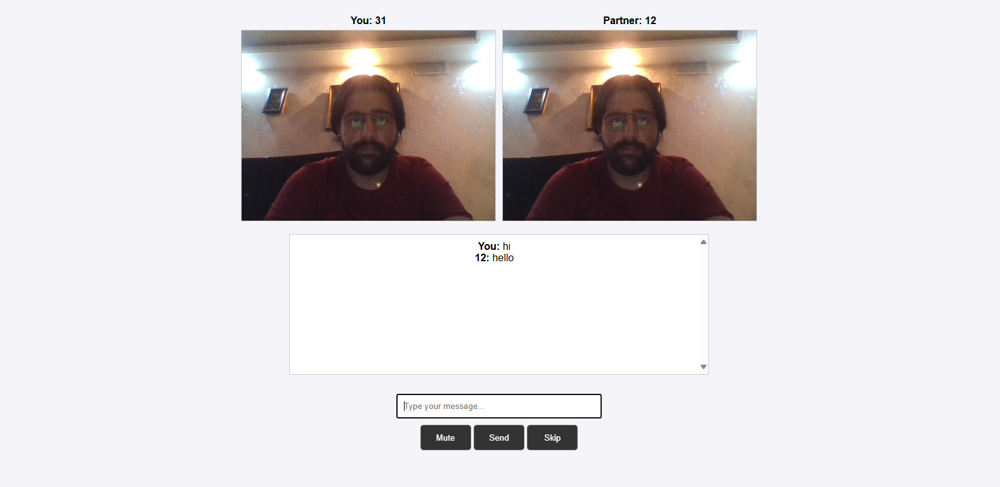

# How to run
- open a command line
- run `git clone github.com/hoseinAsadolahi/omegle`
- run `cd omegle`
- run `code .`
- now in first line change the `YOUR_IP` to the ip address of your device. use ipconfig command.
- run `node server.js`
- go to the `https://YOUR_IP:3000`.

# Enviroment
- login 
- waiting 
- chat 